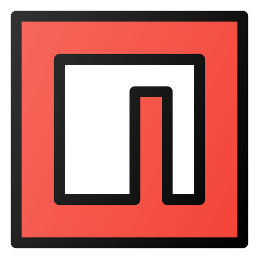

<h1 align="left">
  
  
  Hi! I'm <em>Bryan Gutierrez</em> 🙋🏻‍♂️ 
  I'm a <em>Software Developer</em> 💻
</h1>

 

I am from La Paz, Bolivia. I like to learn new things every day. The **software design and development** are activities I like to do. **Web development** is my favorite area. I love **GNU/Linux** and my favorite distro is **Debian**.

---

## Languages I code with 🖥️

 

[<kbd align="center">      **JavaScript**   </kbd>][jsLink]
[<kbd align="center">      **TypeScript**   </kbd>][typescriptLink]
[<kbd align="center">      **CSS**   </kbd>][cssLink]
[<kbd align="center">      **HTML**   </kbd>][htmlLink]
[<kbd align="center">      **Python**   </kbd>][pythonLink]
[<kbd align="center">      **MySQL**   </kbd>][mysqlLink]

---

## Technologies I use for development 🛠️

 

[<kbd align="center">      **NodeJS**   </kbd>][nodejsLink]
[<kbd align="center">      **NPM**   </kbd>][npmLink]
[<kbd align="center">      **Git**   </kbd>][gitLink]

---

## My social media so you can contact me 📱

 

[<kbd>    **Github**   </kbd>][githubLink]
[<kbd>    **LinkedIn**   </kbd>][linkedinLink]

<!-------------------------------->
<!--------------Links------------->

[jsLink]: https://developer.mozilla.org/en-US/docs/Web/JavaScript
[typescriptLink]: https://www.typescriptlang.org/docs
[cssLink]: https://developer.mozilla.org/en-US/docs/Web/CSS
[htmlLink]: https://developer.mozilla.org/en-US/docs/Web/HTML
[pythonLink]: https://www.python.org/doc
[mysqlLink]: https://dev.mysql.com/doc
[nodejsLink]: https://nodejs.org/docs/latest/api
[npmLink]: https://docs.npmjs.com
[gitLink]: https://git-scm.com/doc
[githubLink]: https://github.com/BryanGuti
[linkedinLink]: https://github.com/BryanGuti

<!-------------------------------->

---

## Sources I get the icons from 🔗

 

<a href="https://www.flaticon.com/free-icons/coding" title="coding icons">Coding icons created by Freepik - Flaticon</a>
<a href="https://www.flaticon.com/free-icons/code" title="code icons">Code icons created by Freepik - Flaticon</a>
<a href="https://www.flaticon.com/free-icons/javascript" title="javascript icons">Javascript icons created by Freepik - Flaticon</a>
<a href="https://www.flaticon.com/free-icons/typescript" title="typescript icons">Typescript icons created by Freepik - Flaticon</a>
<a href="https://www.flaticon.com/free-icons/html" title="html icons">Html icons created by Freepik - Flaticon</a>
<a href="https://www.flaticon.com/free-icons/css" title="css icons">Css icons created by Pixel perfect - Flaticon</a>
<a href="https://www.flaticon.com/free-icons/python" title="python icons">Python icons created by Freepik - Flaticon</a>
<a target="_blank" href="https://icons8.com/icon/UFXRpPFebwa2/mysql-logo">mysql</a> icon by <a target="_blank" href="https://icons8.com">Icons8</a>
<a href="https://www.flaticon.com/free-icons/node-js" title="node js icons">Node js icons created by Freepik - Flaticon</a>
<a href="https://www.flaticon.com/free-icons/npm" title="npm icons">Npm icons created by pocike - Flaticon</a>
<a target="_blank" href="https://icons8.com/icon/20906/git">Git</a> icon by <a target="_blank" href="https://icons8.com">Icons8</a>
<a target="_blank" href="https://icons8.com/icon/iEBcQcM9rnZ9/github">GitHub</a> icon by <a target="_blank" href="https://icons8.com">Icons8</a>
<a target="_blank" href="https://icons8.com/icon/xuvGCOXi8Wyg/linkedin">LinkedIn</a> icon by <a target="_blank" href="https://icons8.com">Icons8</a>